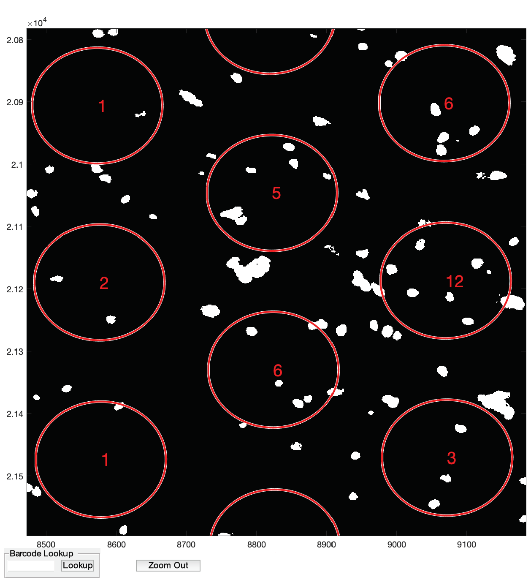

# VistoSeg 

<!-- badges: start -->

<!-- badges: end -->

Welcome to `VistoSeg`! 

This repository describes steps to run Image processing on Visium histology images for Spatial transcriptomics. You can see the documentation at http://research.libd.org/VistoSeg.

## Internal

JHPCE location: `/dcl02/lieber/ajaffe/SpatialTranscriptomics/LIBD/VisiumLIBD`
