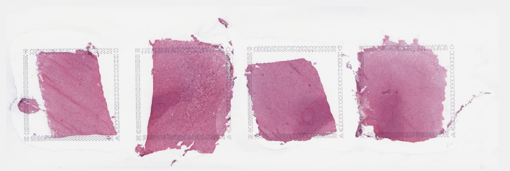

# Step 1: Split Visium histology whole slide image into individual capture area images

The visium histology whole slide image from the imaging system (slide scanner) is a multiplane tif image (~20GB). The sample image [Lieber_Institute_OTS-20-7690_rush_anterior.tif](link to AWS) from the DLPFC dataset is used here to run through the pipeline. 

The inputs to the function [splitSlide.m](https://github.com/LieberInstitute/VisiumLIBD/blob/main/code/splitSlide.m) are 
1. the full path with file name of the raw multiplane tif image (obtained from slide scanner)

The function imports the raw multiplane tif image and saves each plane/image as MATLAB structure and all structures are saved into a single cell array (I) in a '.mat file'. The 1st image of the raw multiplane tif is the raw visium histology slide image, the remaining planes/images consists of the metadata. 

The function then splits the 1st image of the multiplane tif into individual capture areas (A1,B1,C1,D1) and saves them as both `tif images` and `mat files`. The capture areas are resized to 70% of the original size (eg 100 X 100 Pixel region is resized to 70 X 70 pixel region) when saving to tif images as MATLAB cannot store images that occupies more than 2^32 - 1 bytes of data.

```MATLAB
>> cd /path_to_downloaded_repo/VisiumLIBD/code
>> fname = '/path_to_multiplane_tif/Lieber_Institute_OTS-20-7690_rush_anterior.tif';
>> splitSlide(fname)

The multiplane tif has 7 images
Starting parallel pool (parpool) using the 'local' profile ...

Imported image 7 of the multiplane tif
Elapsed time is 0.067836 seconds.
Imported image 6 of the multiplane tif
Elapsed time is 0.030412 seconds.
Imported image 5 of the multiplane tif
Elapsed time is 0.046113 seconds.
Imported image 4 of the multiplane tif
Elapsed time is 0.646907 seconds.
Imported image 3 of the multiplane tif
Elapsed time is 10.682875 seconds.
Imported image 2 of the multiplane tif
Elapsed time is 0.010540 seconds.
Imported image 1 of the multiplane tif
Elapsed time is 165.635605 seconds.
Saving the multiplane tif to mat file
Elapsed time is 1094.729705 seconds.
Splitting image
Elapsed time is 18.653927 seconds.

```
The 7 images of the multiplane tif are shown below.

      <br/>

Though most of the images look same, the first image in the multiplane tif is the high resolution image of the slide based on the image size (y,x,z) in pixels shown below in MATLAB. 

```MATLAB
load('/path_to_multiplane_tif/Lieber_Institute_OTS-20-7748_rush_posterior.mat')
size(I,2) %number of images in the multiplane tif

size(I{1}.image)

ans =

       53384      160858           3

size(I{2}.image)

ans =

         339        1024           3

size(I{3}.image)

ans =

       13346       40214           3
       
size(I{4}.image)

ans =

        3336       10053           3

size(I{5}.image)  

ans =

         834        2513           3

size(I{6}.image)

ans =

         777         765           3

size(I{7}.image)  

ans =

         612        1600           3

```

The image 'I{1}.image' is split into 4 sub images or capture areas by dividing the x(160858) dimesion into 4 equal parts. Sometimes the center of the image is not the center of the slide, in such case the offset is adjusted manually. 

Below are the output files of `slpitSlide` function
1. [Lieber_Institute_OTS-20-7690_rush_anterior.mat](AWS link) - cell array of multiplane tif stored in mat file.
2. [Lieber_Institute_OTS-20-7690_rush_anterior_A1.tif](AWS link) - tif image of compressed capture area A1.
3. [Lieber_Institute_OTS-20-7690_rush_anterior_A1.mat](AWS link) - RGB matrix of uncompressed capture area A1 stored in mat file.
4. [Lieber_Institute_OTS-20-7690_rush_anterior_B1.tif](AWS link) - tif image of compressed capture area B1.
5. [Lieber_Institute_OTS-20-7690_rush_anterior_B1.mat](AWS link) - RGB matrix of uncompressed capture area B1 stored in mat file.
6. [Lieber_Institute_OTS-20-7690_rush_anterior_C1.tif](AWS link) - tif image of compressed capture area C1.
7. [Lieber_Institute_OTS-20-7690_rush_anterior_C1.mat](AWS link) - RGB matrix of uncompressed capture area C1 stored in mat file.
8. [Lieber_Institute_OTS-20-7690_rush_anterior_D1.tif](AWS link) - tif image of compressed capture area D1.
9. [Lieber_Institute_OTS-20-7690_rush_anterior_D1.mat](AWS link) - RGB matrix of uncompressed capture area D1 stored in mat file.
