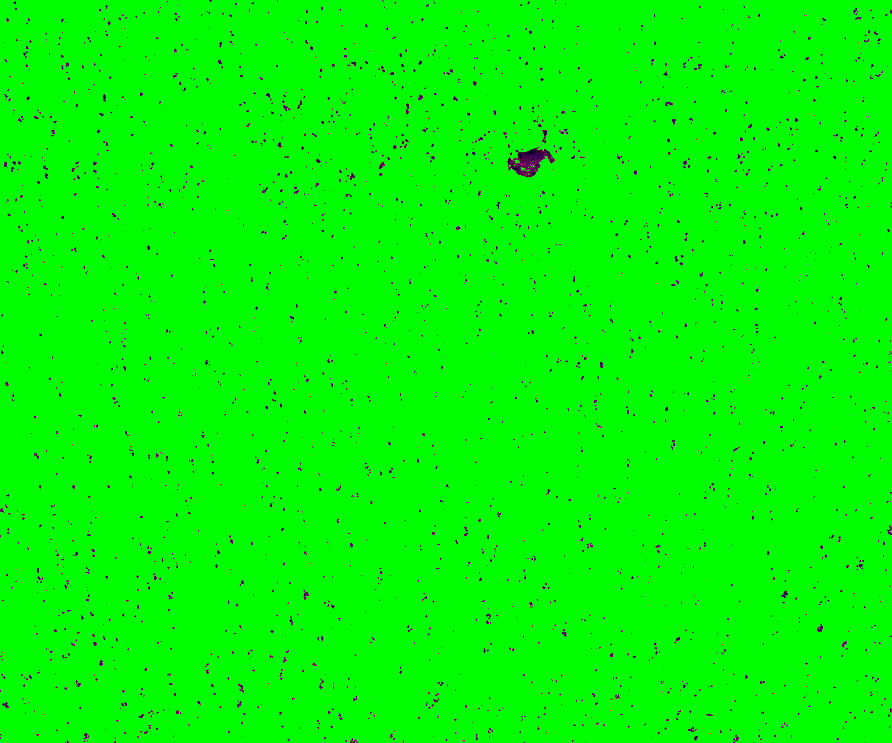
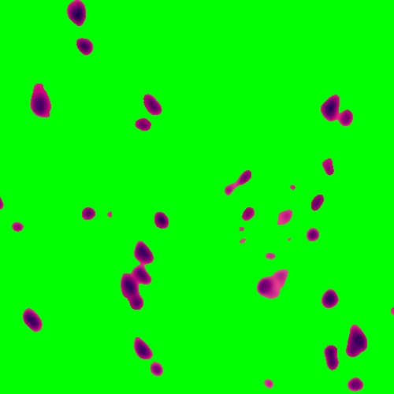
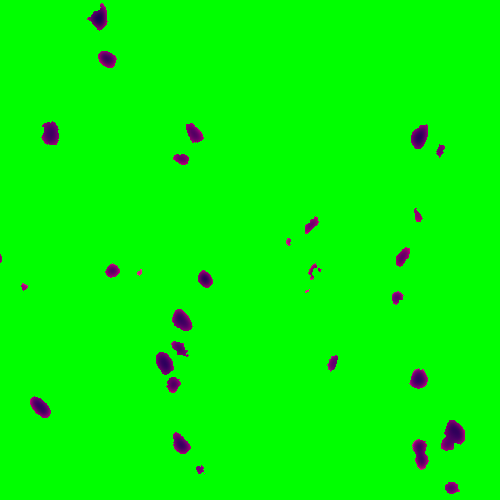

# Step 2: Nuclei segmentation of individual capture areas images

The functions [VNS](https://github.com/LieberInstitute/VistoSeg/blob/main/code/VNS.m) (Visium Nuclei Segmentation) and [refineVNS](https://github.com/LieberInstitute/VistoSeg/blob/main/code/refineVNS.m) from the pipeline are used to perform nuclei segmentation. 

## VNS - Visium Nuclei Segmentation

The inputs to the [VNS](https://github.com/LieberInstitute/VistoSeg/blob/main/code/VNS.m) function  are  

1. The full path to the `.tif` image of a single capture area (output from [Step 1](http://research.libd.org/VistoSeg/step-1-split-visium-histology-whole-slide-image-into-individual-capture-area-images.html): splitSlide function).  
2. The number of colors the user visually identified in the single capture area image.

The [VNS](https://github.com/LieberInstitute/VistoSeg/blob/main/code/VNS.m) function imports the capture area image, applies smoothening to the image to remove any irregularities in the image, and increases the contrast to brighten the nuclei for better detection.  
This function is based on [Color-Based Segmentation Using K-Means Clustering](https://www.mathworks.com/help/images/color-based-segmentation-using-k-means-clustering.html#:~:text=K%2Dmeans%20clustering%20requires%20that,*'%20and%20'b*'%20values.). The smoothed and brightened image is converted from *RGB* (Red, Green, Blue) color space to *CIELAB* color space also called `L*a*b` color space (L - Luminosity layer measures lightness from black to white, a - chromaticity-layer measures color along red-green axis, b - chromaticity-layer measures color along blue-yellow axis). The CIELAB color space quantifies the visual differences caused by the different colors in the image. The `a*b` color space is extracted from the `L*a*b` converted image and is given to the K-means clustering along with the number of colors the user visually identifies in the image.  
The [VNS](https://github.com/LieberInstitute/VistoSeg/blob/main/code/VNS.m) function partitions the image into `n` (number provided by user, 5 for the sample used here) color clusters and saves them as individual objects with an index/label. The color clusters (cell array in matfile), the indexed objects (cell array in matfile) of the color clusters, images of the color clusters (tif) are all saved in the same directory as the input capture area `.tif` image.

```MATLAB
fname = '/path_to_capture_area_tif/Lieber_Institute_OTS-20-7690_rush_anterior_A1.tif';
N = 5; % with some trial and error 5 (white,pink,dark pink,cream,blue) colors
% seem a good prediction for the images produced in-house

VNS(fname,N)
Importing capture area
Elapsed time is 15.122372 seconds.
Performing smoothing and contrast adjustment
Elapsed time is 38.787139 seconds.
Performing rgb to Lab color space conversion
Elapsed time is 65.705037 seconds.
Applying Kmeans
Elapsed time is 494.626476 seconds.
saving outputs
Starting parallel pool (parallel) using the 'local' profile . . .
Elapsed time is 469.198175 seconds.

```
Below is the sample capture area and its associated indexed object and the labels given to these objects.

   

The 5 color clusters and the corresponding indexed objects (with labels 1,2,3,4,5) of a section (shown in red square in the above capture area) of the sample image are shown below. The pixels assigned to that specific color cluster shows up in its original color on left and the indexed object of the same pixels show up in gray scale respective to its label on right. The unassigned pixels in both color cluster and indexed object in that section are shown in green. 

  

  

 

 

 <br/>

Below are the outputs of [VNS](https://github.com/LieberInstitute/VistoSeg/blob/main/code/VNS.m) function for the example image.

1. [Lieber_Institute_OTS-20-7690_rush_anterior_A1_cluster1.tif](https://visium-libd.s3.amazonaws.com/Lieber_Institute_OTS-20-7690_rush_anterior_A1_cluster1.tif)  
2. [Lieber_Institute_OTS-20-7690_rush_anterior_A1_cluster2.tif](https://visium-libd.s3.amazonaws.com/Lieber_Institute_OTS-20-7690_rush_anterior_A1_cluster2.tif)  
3. [Lieber_Institute_OTS-20-7690_rush_anterior_A1_cluster3.tif](https://visium-libd.s3.amazonaws.com/Lieber_Institute_OTS-20-7690_rush_anterior_A1_cluster3.tif)  
4. [Lieber_Institute_OTS-20-7690_rush_anterior_A1_cluster4.tif](https://visium-libd.s3.amazonaws.com/Lieber_Institute_OTS-20-7690_rush_anterior_A1_cluster4.tif)  
5. [Lieber_Institute_OTS-20-7690_rush_anterior_A1_cluster5.tif](https://visium-libd.s3.amazonaws.com/Lieber_Institute_OTS-20-7690_rush_anterior_A1_cluster5.tif)  
6. [Lieber_Institute_OTS-20-7690_rush_anterior_A1_cluster.mat](https://visium-libd.s3.amazonaws.com/Lieber_Institute_OTS-20-7690_rush_anterior_A1_cluster.mat)  
7. [Lieber_Institute_OTS-20-7690_rush_anterior_A1_mask.mat](https://github.com/LieberInstitute/VistoSeg/blob/main/pipeline_outputs/VNS/Lieber_Institute_OTS-20-7690_rush_anterior_A1_mask.mat)


## refineVNS

This function is used to refine the segmentations for accurate detection of nuclei.

The inputs to the function are:

1. The full path to the `.tif` image of a single capture area  
2. The index of the color cluster of the nuclei (obtained from the [VNS](https://github.com/LieberInstitute/VistoSeg/blob/main/code/VNS.m) function)

```MATLAB
fname = '/path_to_capture_area_tif/Lieber_Institute_OTS-20-7690_rush_anterior_A1.tif';
M = 3; %index label 3 was assigned to nuclei for this sample image (shown above)

refineVNS(fname, M)
loading data
Elapsed time is 20.240616 seconds.
refining segmentations
Elapsed time is 118.457338 seconds.
saving final segmentations
Elapsed time is 6.196110 seconds.
```
The nuclei in these images are dark blue objects, the function get rids of the noisy light blue pixels around the nuclei by thresholding the brightness layer of the image (the L object in the  `L*a*b` image). The function provides a binary mask of the refined nuclei saved in `.mat` file and a `.tif` image of the segmented and refined nuclei.

The color cluster of the above section, before and after refining, is shown below.

 

A zoomed in version, basically the 1st 500 pixels in x ang y of the above section is shown here for better visualization.

 

Below are the outputs of the [refineVNS](https://github.com/LieberInstitute/VistoSeg/blob/main/code/refineVNS.m) function for the example image.

1.  [Lieber_Institute_OTS-20-7690_rush_anterior_A1_nuclei.tif](https://github.com/LieberInstitute/VistoSeg/blob/main/pipeline_outputs/Lieber_Institute_OTS-20-7690_rush_anterior_A1_nuclei.tif)  
2.  [Lieber_Institute_OTS-20-7690_rush_anterior_A1_nuclei.mat](https://github.com/LieberInstitute/VistoSeg/blob/main/pipeline_outputs/Lieber_Institute_OTS-20-7690_rush_anterior_A1_nuclei.mat)
