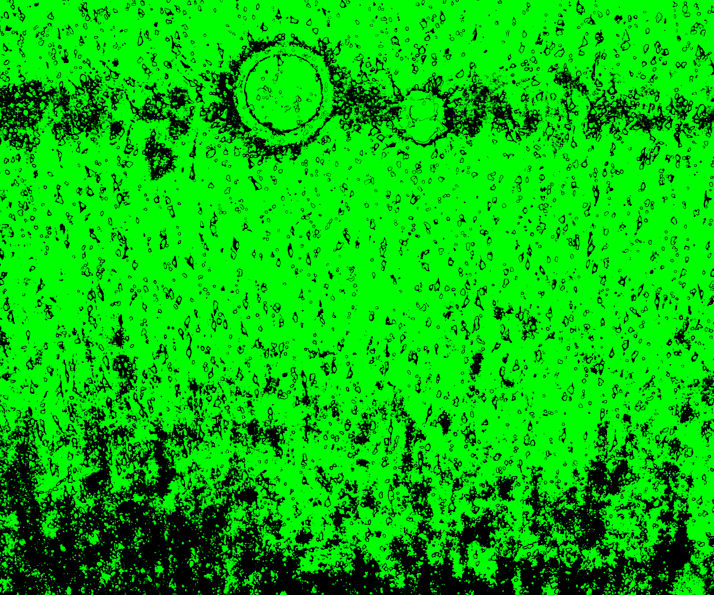
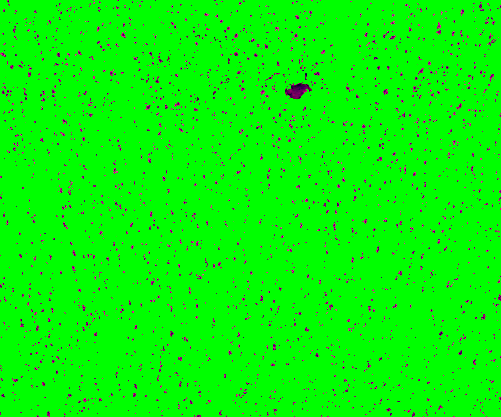
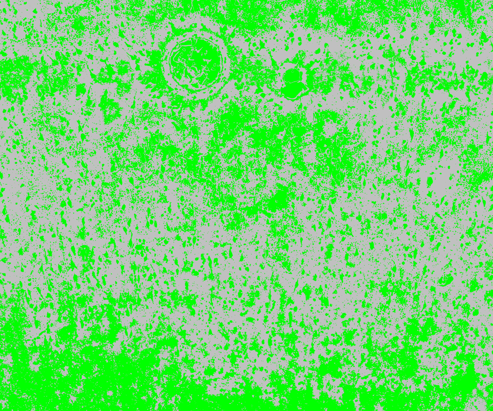
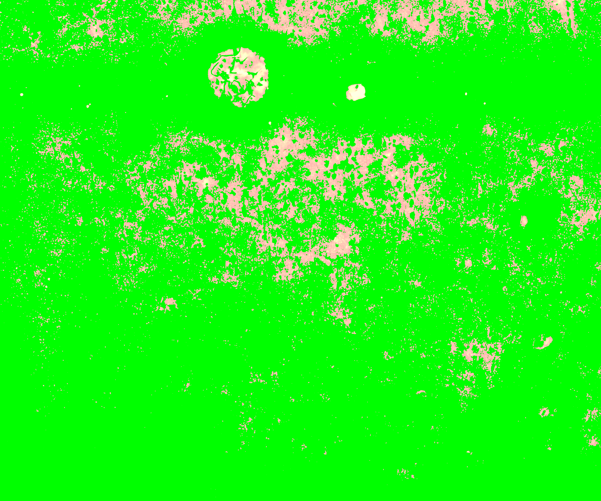

# Step 2: Nuclei segmentation of individual capture areas images

The functions [VNS](https://github.com/LieberInstitute/VisiumLIBD/blob/main/code/VNS.m)(Visium Nuclei Segmentation) and [refineVNS](https://github.com/LieberInstitute/VisiumLIBD/blob/main/code/refineVNS.m) from the pipeline are used to perform nuclei segmentation. 

## VNS - Visium Nuclei Segmentation
The inputs to the [VNS](https://github.com/LieberInstitute/VisiumLIBD/blob/main/code/VNS.m) function  are

1. The tif image of single capture area (output from Step 1: splitSlide function) with full path

2. number of colors a user visually identifies in the single capture area image

The [VNS](https://github.com/LieberInstitute/VisiumLIBD/blob/main/code/VNS.m) function imports the capture area image, applies smoothening to it to get rid of any irregularities in the image and increases the contrast to brighten the nuclei for better detection.  
This function is based on [Color-Based Segmentation Using K-Means Clustering](https://www.mathworks.com/help/images/color-based-segmentation-using-k-means-clustering.html#:~:text=K%2Dmeans%20clustering%20requires%20that,*'%20and%20'b*'%20values.). The smoothened and brightened image is converted from RGB color space to `CIELAB` color space also called `L*a*b` color space (L - Luminosity layer measures lightness from black to white, a - chromaticity-layer measures color along red-green axis, b - chromaticity-layer measures color along blue-yellow axis). The CIELAB color space quantifies the visual differences caused by the different colors in the image. The `a*b` color space is extracted from the `L*a*b` converted image and is given to the K-means clustering along with the number of colors the user visually identifies in the image. 

The [VNS](https://github.com/LieberInstitute/VisiumLIBD/blob/main/code/VNS.m) function partitions the image into n (number provided by user, 5 for the sample used here) color clusters and saves them as individual objects with a index/label. The color clusters (cell array in matfile), the indexed objects (cell array in matfile) of the color clusters, images of the color clusters (tif) are all saved in the same location as the capture area tif image.

```MATLAB
fname = '/path_to_capture_area_tif/Lieber_Institute_OTS-20-7690_rush_anterior_A1.tif';
N = 5; % 5 (white,pink,dark pink,cream,blue) colors seem good for the images produced in-house

VNS(fname,N)

% should add the output printed on matlab command prompt
```
Below is the sample capture area and its associated indexed object and the labels given to these objects.

   

The 5 color clusters and the corresponding indexed objects (with labels 1,2,3,4,5) of a section (shown in red square in the above capture area) of the sample image are shown below. The pixels assigned to that specific color cluster shows up in its original color on left and the indexed object of the same pixels show up in gray scale respective to its label on right. The unassigned pixels in both color cluster and indexed object in that section are shown in green. 

  

  

 

 

 <br/>

Below are the outputs of [VNS](https://github.com/LieberInstitute/VisiumLIBD/blob/main/code/VNS.m) function

1. [Lieber_Institute_OTS-20-7690_rush_anterior_A1_cluster1.tif](link to AWS)

2. [Lieber_Institute_OTS-20-7690_rush_anterior_A1_cluster2.tif](link to AWS)

3. [Lieber_Institute_OTS-20-7690_rush_anterior_A1_cluster3.tif](link to AWS)

4. [Lieber_Institute_OTS-20-7690_rush_anterior_A1_cluster4.tif](link to AWS)

5. [Lieber_Institute_OTS-20-7690_rush_anterior_A1_cluster5.tif](link to AWS)

6. [Lieber_Institute_OTS-20-7690_rush_anterior_A1_cluster.mat](link to AWS)

7. [Lieber_Institute_OTS-20-7690_rush_anterior_A1_mask.mat](https://github.com/LieberInstitute/VisiumLIBD/blob/main/pipeline_outputs/VNS/Lieber_Institute_OTS-20-7690_rush_anterior_A1_mask.mat)


## refineVNS

This function is used to refine the segmentations for accurate detection of nuclei.

The inputs to the function are

1. The tif image of a single capture area with full path

2. The index of the color cluster of the nuclei (obtained from VNS function)

```MATLAB
fname = '/path_to_capture_area_tif/Lieber_Institute_OTS-20-7690_rush_anterior_A1.tif';
M = 3; %index label 3 was assigned to nuclei for this sample image (shown above)

refineVNS(fname,N)
```
The nuclei in these images are dark blue objects, the function get rids of the noisy light blue pixels around the nuclei by thresholding the brightness layer (the L object in the L*a*b image) of the image. The function provdies a binary mask of the refined nuclei saved in mat file and a tif image of the segmented and refined nuclei.

The color cluster of the above section, before and after refining is shown below.

 

A zoomed in version, basically the 1st 500 pixels in x ang y of the above section is shown here for better visualization.

 

Below are the outputs of the [refineVNS]() function

1.  [Lieber_Institute_OTS-20-7690_rush_anterior_A1_nuclei.tif]()

2.  [Lieber_Institute_OTS-20-7690_rush_anterior_A1_nuclei.mat]()
