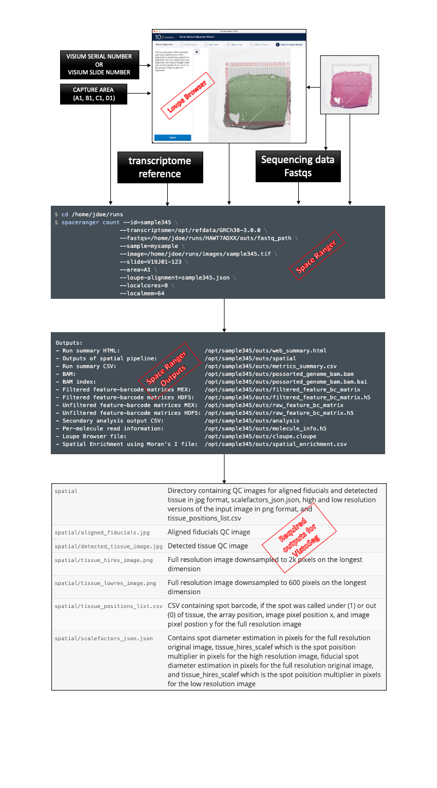

# Step 3: spaceranger

## What is spaceranger? {-}

`spaceranger` is a set of analysis pipelines that process Visium Spatial Gene Expression data with brightfield and fluorescence microscope images. 

The following links and the flowchart provide useful information about `spaceranger` and how to run it on histology images. 

1. [Blog post on running `spaceranger` on JHPCE](http://research.libd.org/rstatsclub/2020/10/20/using-space-ranger-at-jhpce/#.YBpZO2QzYq0)  
2. [Website describing the details](https://support.10xgenomics.com/spatial-gene-expression/software/pipelines/latest/what-is-space-ranger_
3. [Installation](https://support.10xgenomics.com/spatial-gene-expression/software/pipelines/latest/installation)
4. [Useful links](https://docs.google.com/presentation/d/1xw5A0fkJVBZ66lYV87hZg9JFOOZcfVyibsam1kivrqM/edit#slide=id.g9fa4604752_0_29)

The output files [scalefactors_json.json](https://github.com/LieberInstitute/VistoSeg/blob/main/pipeline_outputs/spaceranger/scalefactors_json.json) and [tissue_positions_list.csv](https://github.com/LieberInstitute/VistoSeg/blob/main/pipeline_outputs/spaceranger/tissue_positions_list.csv) generated by the [spaceranger count](https://support.10xgenomics.com/spatial-gene-expression/software/pipelines/latest/using/count) module are required for the next image processing steps. These files provide the Visium spot dimensions, spot locations and barcode IDs to reconstruct the spot grid and overlay the histology image for visual inspection.

The individual split images from [Step 1](http://research.libd.org/VistoSeg/step-1-split-visium-histology-whole-slide-image-into-individual-capture-area-images.html) go through the 10x Genomics [Loupe](https://support.10xgenomics.com/spatial-gene-expression/software/visualization/latest/alignment) browser for manual alignment of the fiducial frame and tissue detection. The output from Loupe Browser along with the split images, their fastqs, slide number, capture area, etc all go into `spaceranger` which finally provides the Visium spot metrics. This entire process is shown in a brief flowchart below.

 

