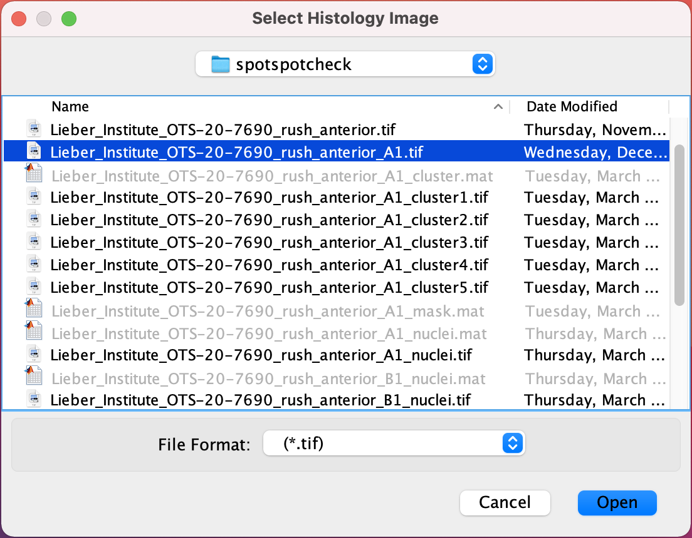
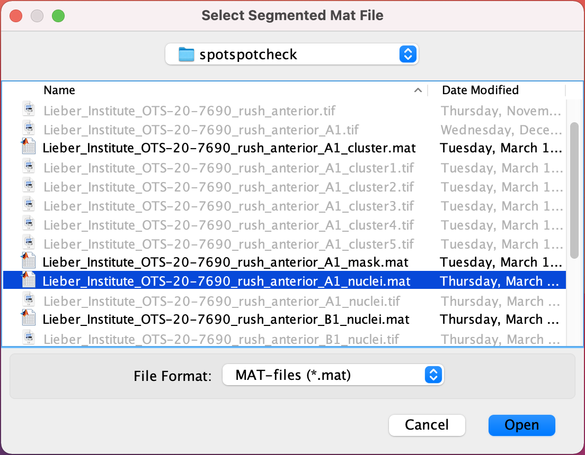
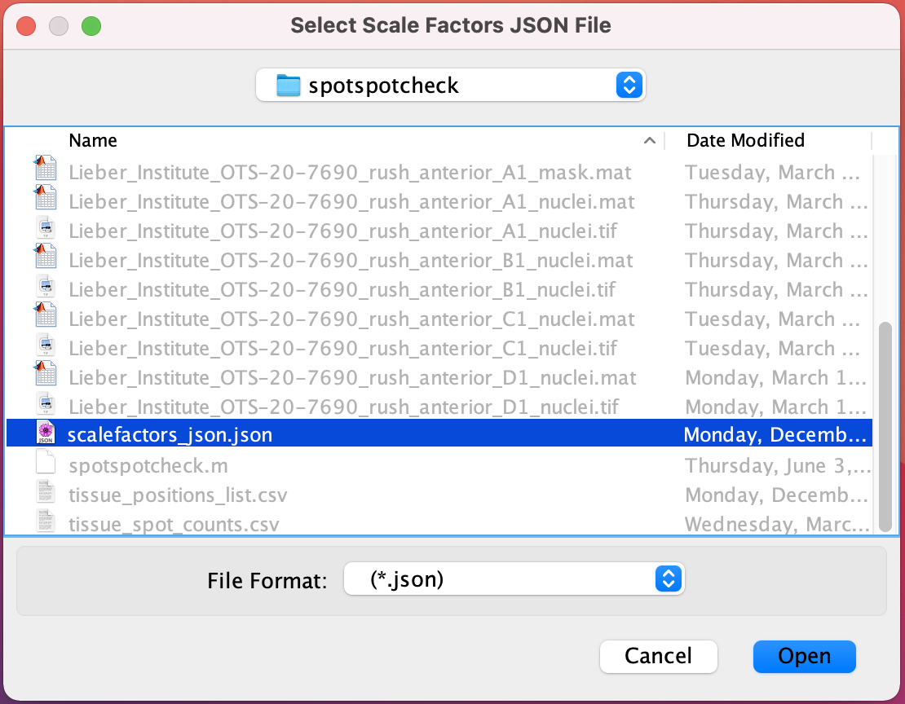
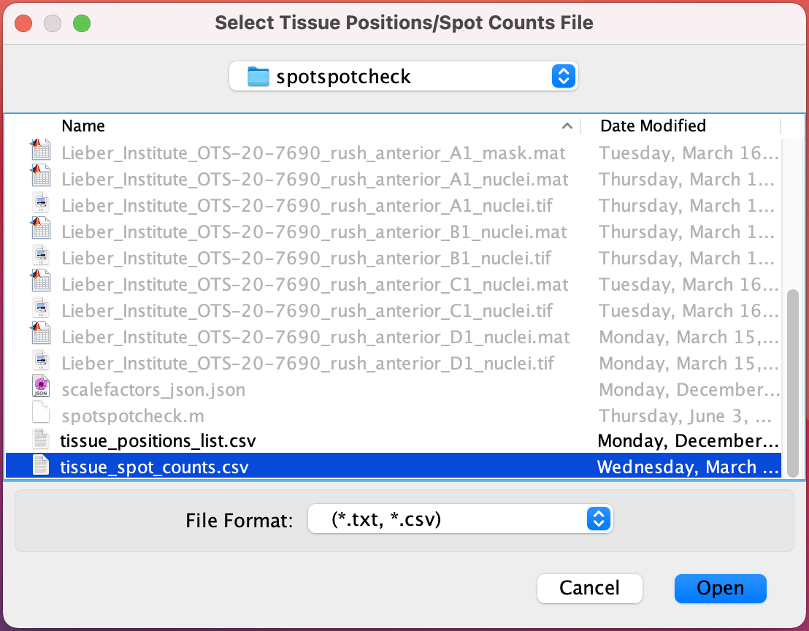
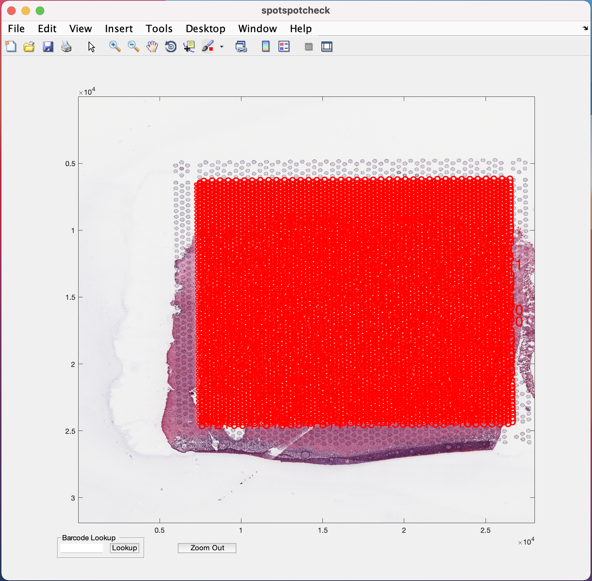
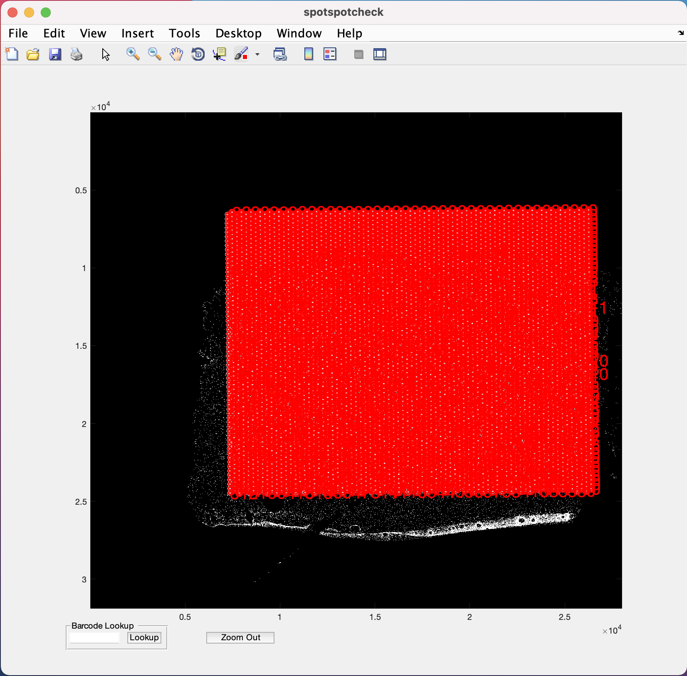
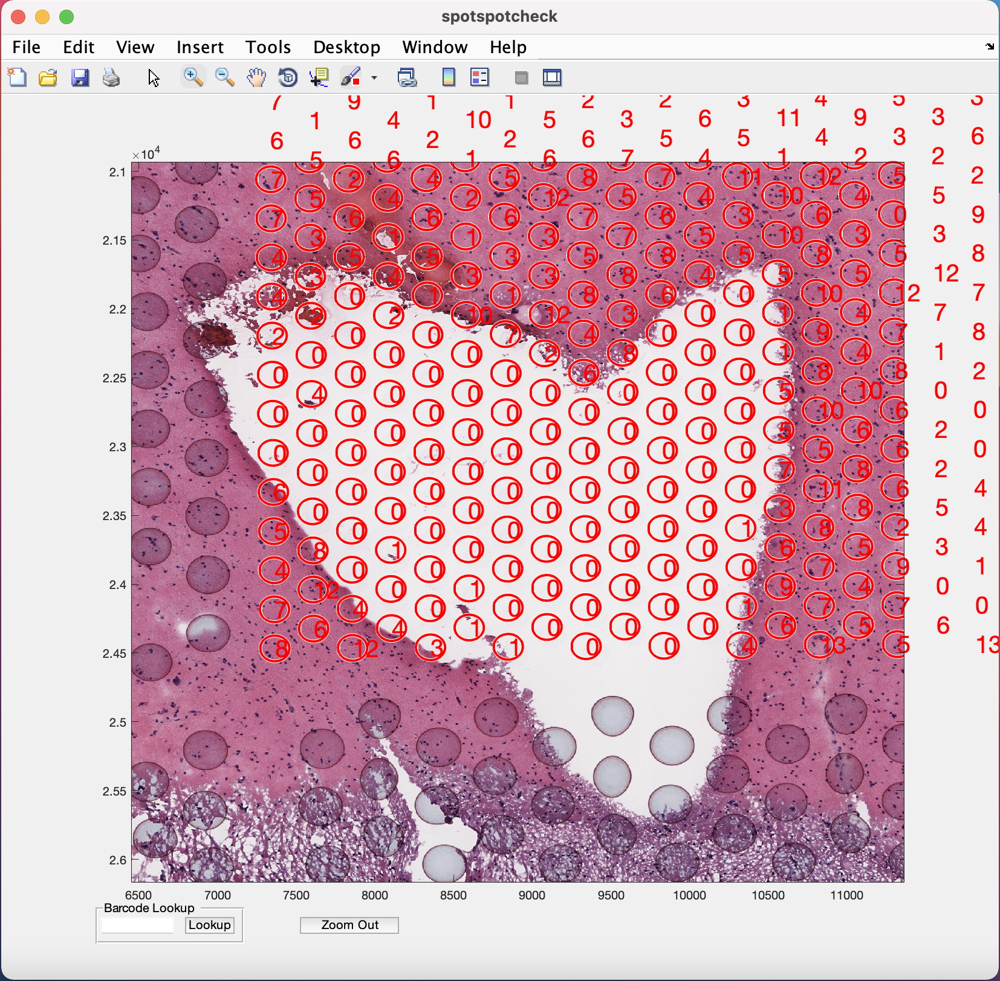
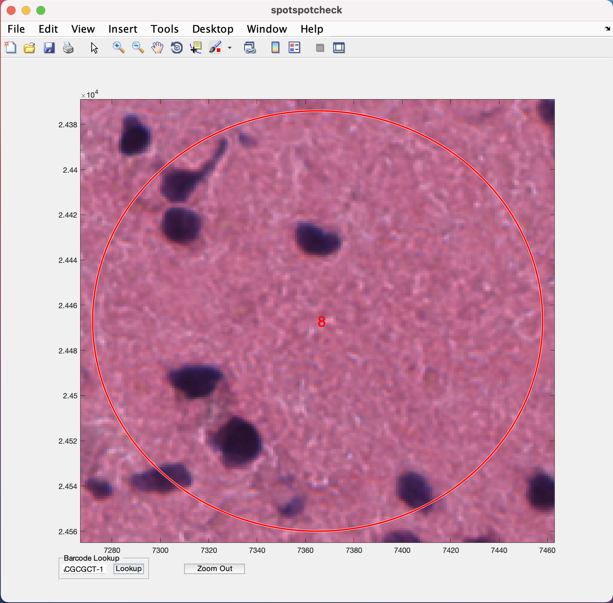

# Step 4: GUI to count nuclei in a visium spot

## spotspotcheck

The GUI is used for
1. Obtaining nuclei count per Visium spot and saving it to a csv.  
2. Performing quality check on the nuclei segmentations (from [Step2](http://research.libd.org/VisiumLIBD/step-2-nuclei-segmentation-of-individual-capture-areas-images.html)) by allowing the user to zoom in/out and toggle between the nuclei segmentation and visium histology images. The GUI overlays the spot grid on to the visium histology and segmentation images for the user to clearly see the nuclei inside a spot.  
3. It allows the user to search for a spot with its associated barcode ID.

To open the GUI, the [spotspotcheck](https://github.com/LieberInstitute/VisiumLIBD/blob/main/code/spotspotcheck.m) function should be executed in the MATLAB command prompt like below.

```MATLAB
spotspotcheck
loading.....
```

1. **Start Window** : A start window opens up like below. If you donot have the [tissue_spots_counts.csv](https://github.com/LieberInstitute/VisiumLIBD/blob/main/pipeline_outputs/spotspotcheck/tissue_spot_counts.csv) already, generated from the command line function [countNuclei](https://github.com/LieberInstitute/VisiumLIBD/blob/main/code/countNuclei.m), the option to `Get Cell Counts` on the window should be checked.
<center>
 
</center>
Then you hit the `Start` button which opens up the following window.

2. **Select Histology Image** : This window asks you to select the capture area tif that you want the nuclei counts for or to perform quality check on nuclei segmentations.
<center>
 
</center>
Select the capture area tif and hit the `Open` button on window, which opens the following window.

3. **Select Segmented Mat File** : This wondow asks for the final segmented `.mat` file of the nuclei segmentations.
<center>
 
</center>
Select the [.mat](https://github.com/LieberInstitute/VisiumLIBD/blob/main/pipeline_outputs/refineVNS/Liebert_Institute_OTS-20-7690_rush_anterior_A1_nuclei.mat) file and hit the `Open` button.

4. **Select Scale Factors JSON File** : Select the [scalefactors_json.json](https://github.com/LieberInstitute/VisiumLIBD/blob/main/pipeline_outputs/spaceranger/scalefactors_json.json) file with the visium spot metrics obtained from the [Space Ranger](https://support.10xgenomics.com/spatial-gene-expression/software/pipelines/latest/what-is-space-ranger) software.
<center>
 
</center>

5. **Select Tissue Positions/Spot Counts File** : If the `Get Cell Counts` option is checked in the Start window then select [tissue_positions_list.csv](https://github.com/LieberInstitute/VisiumLIBD/blob/main/pipeline_outputs/spaceranger/tissue_positions_list.csv) obtained from **Spaceranger**, otherwise select [tissue_spot_counts.csv](https://github.com/LieberInstitute/VisiumLIBD/blob/main/pipeline_outputs/spotspotcheck/tissue_spot_counts.csv) obtained from [countNuclei](https://github.com/LieberInstitute/VisiumLIBD/blob/main/code/countNuclei.m) function.
<center>
 
</center>


6. **spotspotcheck** GUI opens up, shown below
<center>
 
</center>

By clicking anywhere on the image inside the GUI, the user can toggle between the Histology and segmented image, shown below.
<center>
 
</center>

The zoom in (symbol of magnifying glass with `+`) option is provided in the menubar at the top of the GUI (Note the position of this option on the GUI may change depending on the version of MATLAB being used, but it is always represented by the `+` symbol). Selecting/clicking this option opens a cursor with `+` symbol, which lets the user select a rectangular region of interest to zoom in to, like the image below. The `Zoom Out` button at the bottom of GUI is used for the images to return to their original size on GUI.
<center>
 
</center>

To toggle between histology/segmented images when zoomed in, the cursor should should return to its normal function by unclicking the zoom in (symbol of magnifying glass with `+`) option.

  

The dialog box at the bottom of the GUI with the label `Barcode Lookup` provides user to input the barcode ID of the specific visium spot the user want to look at. For example if we want to look at the 1st visium spot on this image, paste the barcode ID of the spot (from [tissue_spot_counts.csv](https://github.com/LieberInstitute/VisiumLIBD/blob/main/pipeline_outputs/spotspotcheck/tissue_spot_counts.csv)) into the white space and hit the `Lookup` button. It opens up the image where ever this spot is located.
<center>
 
</center>

## countNuclei

This function can be run on MATLAB command prompt to obtain the [tissue_spot_counts.csv](https://github.com/LieberInstitute/VisiumLIBD/blob/main/pipeline_outputs/spotspotcheck/tissue_spot_counts.csv) file without going through the GUI.

Inputs to the function are  
1. Filename with full path for the mat file of the final nuclei segmentation.  
2. Filename with full path for the scalefactors_json json file.  
3. Filename with full path for the tissue_positions_list csv file.

```MATLAB
mask = '/path_to_capture_area_segmentation/Lieber_Institute_OTS-20-7690_rush_anterior_A1_nuclei.mat';
jsonname = '/path_to_scalefactors_json/scalefactors_json.json';
posname = '/path_to_tissue_positions_list/tissue_positions_list.csv';

countNuclei(mask,jsonname,posname)                                           loading data                
Elapsed time is 4.216505 seconds.
84385 cells detected
4992 spots detected
counting nuclei per spot
100 spots finished in time 77.1357s
200 spots finished in time 140.8369s
300 spots finished in time 204.5829s
400 spots finished in time 267.4467s
.
.
.
```

The  [countNuclei](https://github.com/LieberInstitute/VisiumLIBD/blob/main/code/countNuclei.m) function generates a nuclei count file listed below. The file is saved in the same path as the [tissue_positions_list.csv](https://github.com/LieberInstitute/VisiumLIBD/blob/main/pipeline_outputs/spaceranger/tissue_positions_list.csv) that we give to the function.  
1.  [tissue_spot_counts.csv](https://github.com/LieberInstitute/VisiumLIBD/blob/main/pipeline_outputs/spotspotcheck/tissue_spot_counts.csv)


