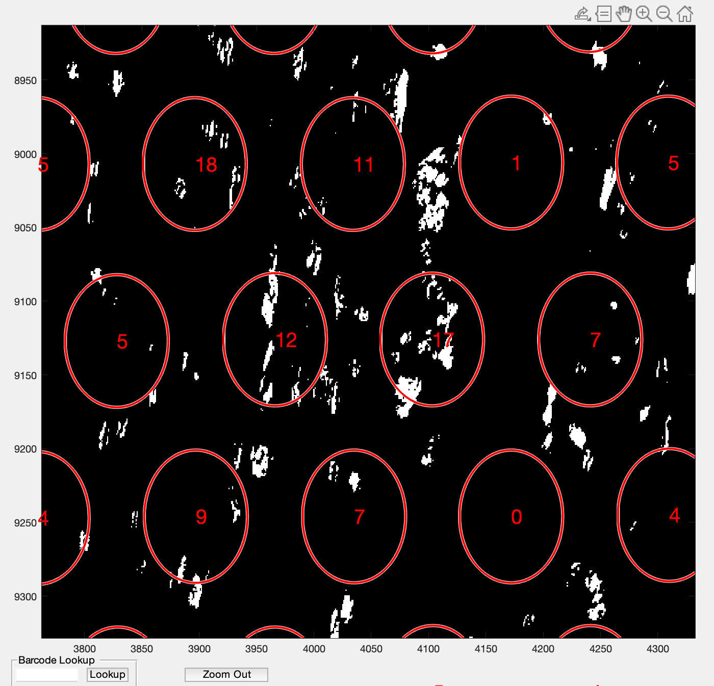

# Step 5: Test data and Future directions

## TEST DATA
The pipeline with default settings (smoothening and color clusters of k-means in VNS function) used for in house data has been applied on the [public datasets] (https://support.10xgenomics.com/spatial-gene-expression/datasets) 10x provided. We chose 2 images one from [breast tissue](https://support.10xgenomics.com/spatial-gene-expression/datasets/1.1.0/V1_Breast_Cancer_Block_A_Section_1) with high density of cells and the other from [human heart tissue](https://support.10xgenomics.com/spatial-gene-expression/datasets/1.1.0/V1_Human_Heart) with low density of cells, to demonstrate the utility of the pipeline on images obtained from different tissues. Decent segmentation results were obtained with the default settings given the low the image resolution. Accurate results can be obtained with little parametric tuning. A zoom in versions from `spotspotcheck` are shown below for better visualization.

1. Heart Tissue

```Matlab
code = '/path to the code/VisiumLIBD/code';
addpath(genpath(code))
fname = '/path to the file/V1_Human_Heart_image.tif';
N = 5;

VNS(fname,N)
Importing capture area
Elapsed time is 12.898534 seconds.
Performing smoothening and contrast adjustment
Elapsed time is 15.198035 seconds.
Performing rgb to Lab color space conversion
Elapsed time is 17.632075 seconds.
Applying Kmeans
Elapsed time is 277.069572 seconds.
saving outputs
Starting parallel pool (parpool) using the 'local' profile ...
Connected to the parallel pool (number of workers: 2).
Elapsed time is 161.220875 seconds.

```

  
      1.Output from spotspotcheck [tissue_spot_counts.csv](https://github.com/LieberInstitute/VisiumLIBD/blob/main/pipeline_outputs/spotspotcheck/tissue_spot_counts_heart.csv) 
      2.Final nuclei segmentations: [nuclei.tif](https://github.com/LieberInstitute/VisiumLIBD/blob/main/pipeline_outputs/refineVNS/V1_Human_Heart_image_nuclei.tif), [nuclei.mat](https://github.com/LieberInstitute/VisiumLIBD/blob/main/pipeline_outputs/refineVNS/V1_Human_Heart_image_nuclei.mat)

2. Breast Tissue

```Matlab

```

  

## FUTURE DIRECTIONS

1. To integrate Atlas Aligner for brain region identification
2. To integrate [VAMPIRE](https://www.nature.com/articles/srep18437) for cell morphology detection