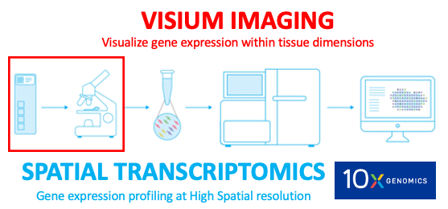

# Overview {-}
**Visium imaging** is a part of whole **spatial transcriptomics** workflow, a barcoding-based transcriptome-wide technology released by [10X genomics](https://www.10xgenomics.com).
<center>
 
</center>
<center>

</center>

## Why *spatial transcriptomics* or *visium imaging*?? {-}
Methods like RNAseq can profile single cells transcriptome-wide and enable researchers to identify cell type compositions but can necessarily destroy the spatial information. Multiplexing methods on other hand can provide spatial information but has significant limitations on the number of genes that can be processed and has issues with microscopy and related computational challenges. **Spatial transcriptomics** provides solutions to these limitations allowing us to quantify gene expression with high spatial resolution. The key to this system is the **visium imaging** and [visium gene expression slide](https://www.10xgenomics.com/products/spatial-gene-expression), where the tissue sections from subjects goes onto the **capture areas (A1,B1,C1,D1)** on the slide. The whole slide is imaged at once and produces a huge output image file with all capture areas. The whole slide image has to be split into individual capture area images (necessarily JPEG or tif) and processed accordingly for the downstream analysis.

This website describes the steps required to split, visualize and process the visium images from spatial transcriptomics projects generated by the [10x Genomics  Visium](https://www.10xgenomics.com/spatial-transcriptomics) commercial platform.
\centering

The above figure describes the VisiumLIBD pipeline, (A) The data presented here is from a portion of DLPFC (taken from posterior, mid and anterior sections of brain per sample) that spans six neuronal layers plus white matter. (B) Shows the original *'Visium gene expression slide'* with 4 capture areas and the slide scanner used to image the slide. (C) Shows the huge tif file produced by the slide scanner which is then split into the respective capture areas using the function [splitSlide](https://github.com/LieberInstitute/VisiumLIBD/blob/main/code/split.m) described in [Step 1](http://research.libd.org/VisiumLIBD/step-1-split-visium-histology-whole-slide-image-into-individual-capture-area-images.html) (D) Shows the individual tif images of capture areas produced by [splitSlide](https://github.com/LieberInstitute/VisiumLIBD/blob/main/code/split.m)  and its corresponding nuclei segmentations produced by the functions [VNS](https://github.com/LieberInstitute/VisiumLIBD/blob/main/code/VNS.m) (Visium Nuclei Segmentation) and [refineVNS](https://github.com/LieberInstitute/VisiumLIBD/blob/main/code/refineVNS.m) explained in [Step 2](http://research.libd.org/VisiumLIBD/step-2-nuclei-segmentation-of-individual-capture-areas-images.html) (E) The tif images from *'(D)'* serve as input to the [Spaceranger](https://support.10xgenomics.com/spatial-gene-expression/software/pipelines/latest/using/count) module (explained in [Step 3](http://research.libd.org/VisiumLIBD/step-3-Space-Ranger.html) which generates [tissue_positions_list.csv](https://github.com/LieberInstitute/VisiumLIBD/blob/main/pipeline_outputs/spaceranger/tissue_positions_list.csv) file and [scalefactors_json.json](https://github.com/LieberInstitute/VisiumLIBD/blob/main/pipeline_outputs/spaceranger/scalefactors_json.json) file that contain *'Visium spot metrics'* (F) The function [countNuclei](https://github.com/LieberInstitute/VisiumLIBD/blob/main/code/countNuclei.m) explained in [Step 4](http://research.libd.org/VisiumLIBD/step-4-gui-for-nuclei-count-in-a-visium-spot.html), gives the nuclei count per visium spot info that is stored in [tissue_spot_counts.csv](https://github.com/LieberInstitute/VisiumLIBD/blob/main/pipeline_outputs/spotspotcheck/tissue_spot_counts.csv) file (G) Finally, the pipeline provides a GUI called [spotspotcheck](http://research.libd.org/VisiumLIBD/step-4-gui-for-nuclei-count-in-a-visium-spot.html#spotspotcheck) that allows the user to perform visual inspection of the nuclei segmentations by allowing the user to toggle between the visium and binary images, and also by providing zoom in/out options to clearly see the nuclei inside a visium spot.

## Cite `VisiumLIBD` {-}
We hope that [VisiumLIBD](http://research.libd.org/VisiumLIBD/) will be useful for your research. Please use the following information to cite the package and the overall approach. Thank you!
```
@article {,
	author = {Tippani, Madhavi and other names to include},
	title = {VisiumLIBD: a semiautomated MATLAB pipeline for visualizing and processing high resolution visium images whose output is used for downstream spatial transcriptomics analyis},
	elocation-id = {},
	year = {2021},
	doi = {},
	publisher = {Oxford Bioinformatics},
	abstract = {},
	URL = {https://www.overleaf.com/read/fmvrpsyxgsbz},
	eprint = {https://www.overleaf.com/read/fmvrpsyxgsbz},
	journal = {bioRxiv}
}
```
Project lead: **Imaging Development Team** from **Keri Martinowich's Lab** at the [Lieber Institute for Brain Development](https://www.libd.org/).


## Image Acquisition {-}
The 10X [Visium Spatial Gene Expression Imaging Guidelines](https://support.10xgenomics.com/spatial-gene-expression/imaging/doc/technical-note-visium-spatial-gene-expression-imaging-guidelines) are followed for acquiring the images. Images are acquired at 40x magnification using a Leica CS2 slide scanner and saved as *'.SVS files.'* These *'.SVS files'* are then exported as *'TIF files'* for downstream analysis. The entire Visium slide (4 capture areas with fiducial frames), is scanned in a single file (~20GB).

## Software Requirements {-}
The pipeline was developed under the following software configuration.
<center>

</center>

`VisiumLIBD` has been tested on Linux, Windows and MacOS.

1. `MATLAB`  
MATLAB version R2019a 64-bit or later is required to run VisiumLIBD pipeline with the [Image Processing Toolbox](https://www.mathworks.com/products/image.html) preloaded.
 
2. `Memory`  
Visium whole slide images are high resolution, and the typical size of these multiplane tif images produced inhouse is ~25GB. The system RAM (we use ~75GB) should be thrice the size of the multiplane tif image to load it into MATLAB and the disc space (we use ~100GB) should be atleast 4 times the size of multiplane tif to store the output.

3. `Installation`  
The pipeline is availble at (https://github.com/LieberInstitute/VisiumLIBD) which can be download to your system from the Github website directly or the main repository can be cloned to your system using the following command on terminal/command prompt.  
              `git clone https://github.com/LieberInstitute/VisiumLIBD.git`
    
All the code exists in the [code](https://github.com/LieberInstitute/VisiumLIBD/tree/main/code) directory inside the main [VisiumLIBD](https://github.com/LieberInstitute/VisiumLIBD) directory. 
The user's working directory on MATLAB should be the path to the [code](https://github.com/LieberInstitute/VisiumLIBD/tree/main/code) directory in the downloaded repository, to run any functions this pipeline provides. Once the repository is downloaded, the user can run either of the following code to change his/her working directory on MATLAB to the [code](https://github.com/LieberInstitute/VisiumLIBD/tree/main/code) directory.  
              `cd /path_to_the_downloaded_repository/VisiumLIBD/code/` 
              `addpath(genpath('/path_to_the_downloaded_repository/VisiumLIBD/code/'))`

## Data Availability {-}
All the raw data and few of the pipeline outputs are hosted at the following link (https://github.com/LieberInstitute/spatialLIBD#raw-data).

**Other potential datasets**  
1. [LIBD pilot DLPFC](https://github.com/LieberInstitute/spatialLIBD#raw-data)   
2. [10x Genomics spatial data sets](https://support.10xgenomics.com/spatial-gene-expression/datasets) 


